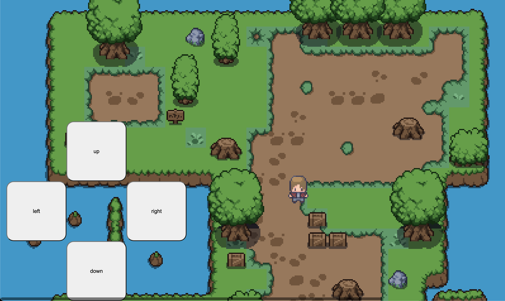

Me exploring game developing in vanilla HTML, CSS, and JavaScript

## How to play

- Use the `WASD` keys to move the player
- Use the `j` key to jump
- Hold the `k` key to run
- Press the `return` key at the ball to make a swing
- Press the `return` key at the desired power to hit the ball

## Todo

- [x] Golf hole

  - [x] Golf hole asset
  - [x] Golf hole model in code
  - [x] Golf collision with the hole

- [x] Golf ball arc animation
- [x] Golf ball shadow animation

- [] Golf ball collision with the trees
- [] Golf club

  - [] Golf club asset
  - [] Golf club model in code
  - [] Golf club offset from the player
  - [] Golf club swing animation
  - [] Golf club collision with the ball

- [] Golf ball collision with the water
  - [] Golf ball splash animation
- [] Golf ball collision with the sand
- [] Golf ball collision with the grass

- [] UI
  - [] layer list with enable/disable toggles for drawables and movables
  - [] layer list with enable/disable toggles for collidables
  - [] color picker for stroke and fill
